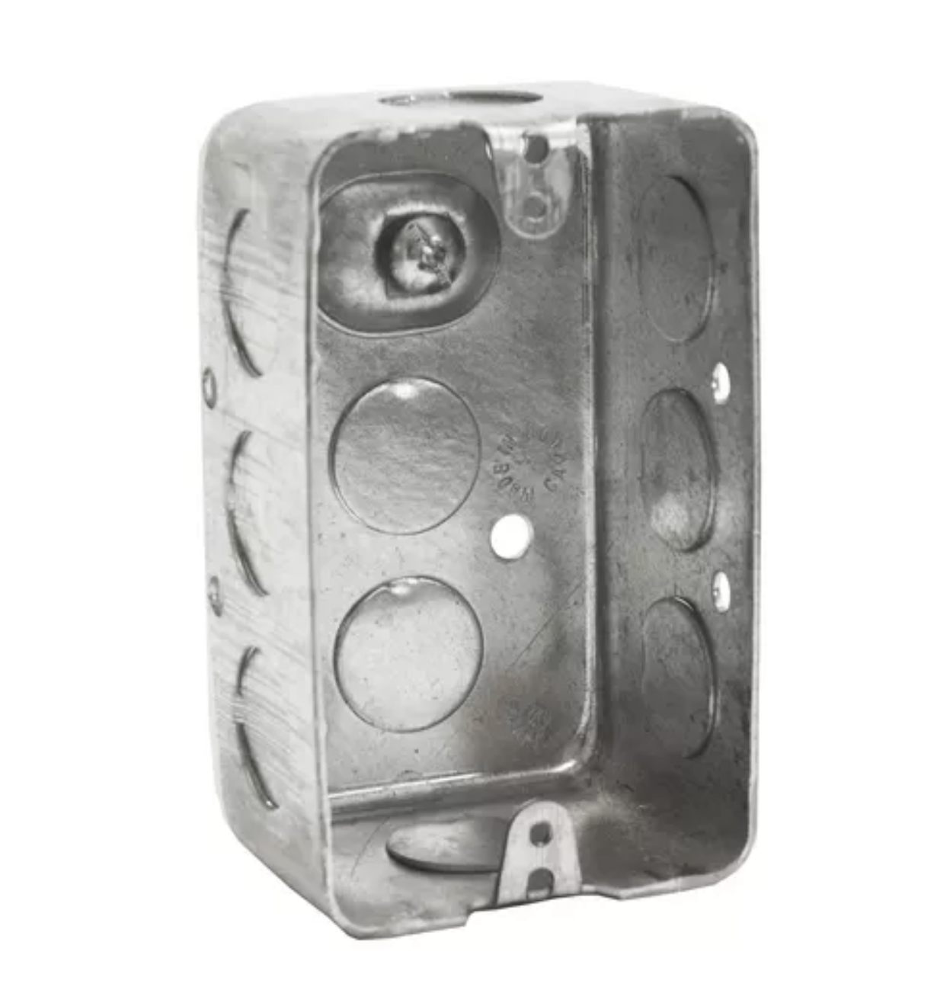
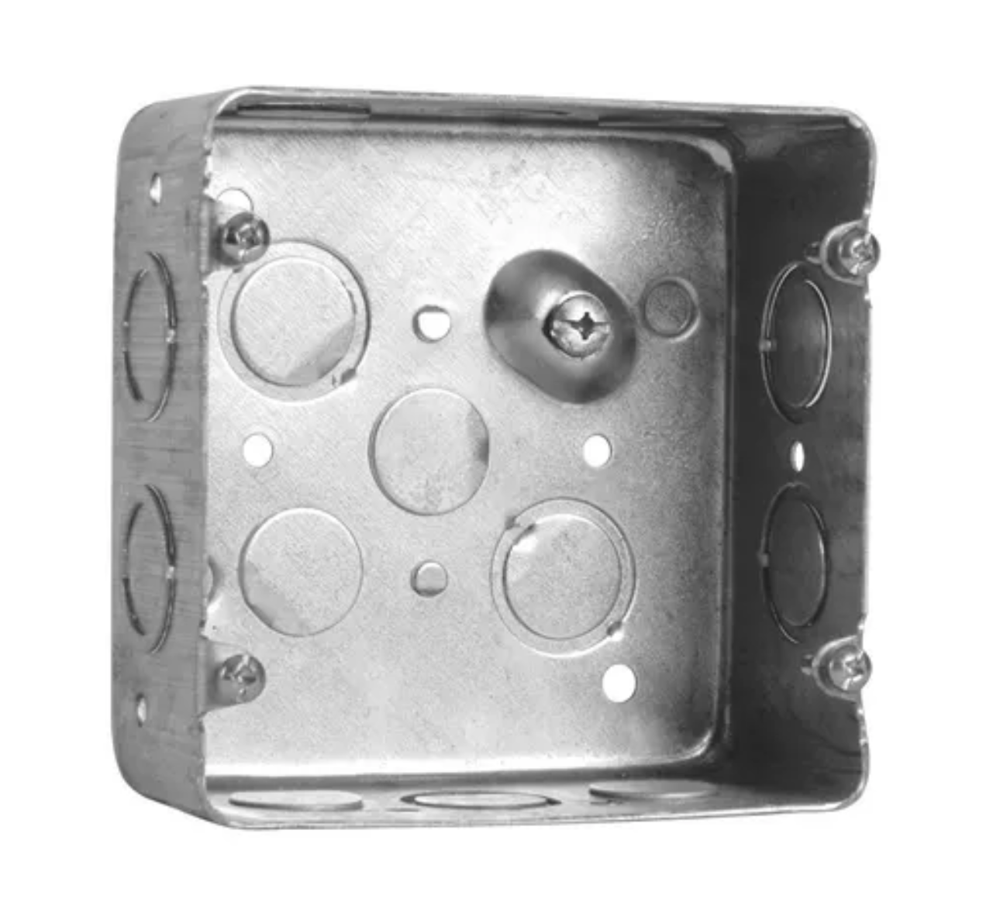
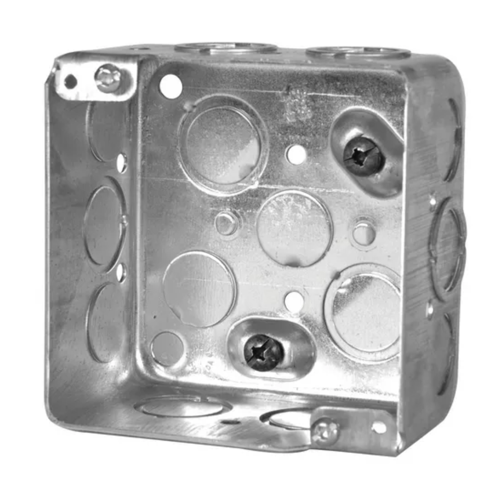

# Design
The purpose of Handybox is to benefit several types of projects with one standard part, accompanied by several other standards that have a well-established ecosystem and many available components near you at brick-and-mortar stores.
I Hope you benefit from the concepts here - even without building any handybox designs you will find some techniques that save time in CAD, prototyping, wiring, or creating new concepts for designs.

# Videos
To be populated as I create videos to explain features.

## Build a Car Adapter

<iframe width="703" src="https://www.youtube.com/embed/VLrEtrU10ow" title="Build a DIY power supply for powering electronics - using openBox" frameborder="0" allow="accelerometer; autoplay; clipboard-write; encrypted-media; gyroscope; picture-in-picture; web-share" referrerpolicy="strict-origin-when-cross-origin" allowfullscreen></iframe>

# Parts
Components, methods, and considerations for organizing wires in projects.  It's best to watch this before you design, so you can discover parts to integrate in your project plans.

## Main Parts
Main components around which the other parts are designed.

* EMT Conduit
* Handybox electrical boxes with 1/2in knockout holes
* Switches, 22mm, toggle switches
* Outlets, ordinary 120v North America standard

## Large Box
The large box is uploaded as a "configuration" of the solidworks model, in grabCAD.  It's a square box, sometimes sold with 4 tabs for 2-gang configuration.

## HandyMount
Mount your boxes to your DIN rail, multiple orientations & box sizes.

This bracket is parametric, with configurations shown in the animated GIF. The narrow option has 1-in spacing for the 1-gang box and the wide option matches the 1.5in spacing of the square boxes found in local stores.

## Bushing
A feature for electrical and for mechanical function

Version 1 is adapted for fixing anderson connectors into the wall of a panel.

It can be adjusted for different hole sizes, or different center features.  You may wish to use it as a grommet, or adapter for a 10mm pushbutton, or 100 other items.  The idea is that a new user gains a new function but retains the investment of the code behind the nicely made parametric part.  The feature tree is easy to navigate, so you may update the design without knowledge of all the original design considerations. (just like open source software).

# Benchmarks
Every good design begins with an evaluation stage.  If you want to invent something that helps the community, start by searching for benchmarks. 
* existing products that perform **the function** you want
* existing parts that contain **the geometry** you'll design
* industrial parts that are often more robust than consumer goods
* unrelated market categories which solve equivalent functions

In the benchmarking process for an OpenBox-related design, start with the catalog & technical drawings below.

## Design Catalog

### USA Handy Box Specifications by Brands

#### 666 CUS by RACO (4” x 2” x 1-7/8”)

- 4 in. x 2 in. Handy Box, Drawn, 1-7/8 in. Deep with Seven 1/2 & One 3/4 in. KO's, Raised Ground
- [download (100mb)](https://lobfile.com/file/TMfW62ny.pdf)
- [img_technicalData1](https://github.com/user-attachments/assets/8c5ebed6-eeb9-4228-b587-385ee21200a7) _see material properties, dimensions, & more_
- [image techsheet](img/img_racoData1.jpg 'class=image-25') _technical sheets published by manufacturers_
- [img_drawing](https://github.com/user-attachments/assets/256211c1-f47f-49f2-863e-14f5fdbfc8e6) _dimensional drawings by manufacturers (Raco & more)_

We don't have a specific structure for posting data but as I accumulate useful drawings and reliable documentation behind the branded boxes (suchas Raco by Hubbel) I will upload the content for others to download.  At times, I markup a PDF with mechanical drawings to point out the key items instead of starting a document from scratch.

### Canadian Handy Box Specifications by Brands

The key difference in the brackets is that the USA version uses straight mounting brackets, while the Canadian version features angled brackets, requiring design adjustments for compatibility. They also are designed for the Canadian Electrical Code (CEC) standards.

#### [2020-CRT](https://new.abb.com/products/7TBA126550R0005/2020-crt) by Iberville (4” x 2-3/8” x 1-7/8”)

- [2020-CRT](https://new.abb.com/products/7TBA126550R0005/2020-crt) While these boxes are widely used and recognized, ABB has not yet provided a detailed data sheet for the Iberville handy box. This lack of official specifications presents a challenge for precise design adaptations, but we are working to gather the necessary details through direct measurements and other resources.
- https://new.abb.com/products/7TBA126550R0005/2020-crt

#### [1110CN](https://www.hubbell.com/hubbellcanada/en/products/utility-box-1-78-in-deep-16-5-cu-in-with-raised-ground-screw-12-in-ko-50-pack-1110cn/p/4664370) by TradeSelect (4" x 2-1/2" x x 1-7/8")

- Utility Box, 1-7/8 in. Deep, 16.5 Cu. In., with Raised Ground Screw, 1/2 in. KO
- [Datasheet](https://hubbellcdn.com/salesdrawings/1110CN.pdf)
- https://www.hubbell.com/hubbellcanada/en/products/utility-box-1-78-in-deep-16-5-cu-in-with-raised-ground-screw-12-in-ko-50-pack-1110cn/p/4664370

### [72171K](https://www.hubbell.com/hubbellcanada/en/products/4-square-box-2-deep-ko-30-pack-72171kbar/p/4674800) by TradeSelect (4.688'' X2.125'' K)

- 4-11/16 In. Square Box, 2-1/8 in. Deep, 42 Cu. In., with Raised Ground Screw, with Concentric, 1/2 & 3/4 in. KO
- [Datasheet](https://hubbellcdn.com/salesdrawings/72171K.pdf)
- https://www.hubbell.com/hubbellcanada/en/products/4-square-box-2-deep-ko-30-pack-72171kbar/p/4674800

### 52171K by TradeSelect (4X4" x 2.125" x ?)

- 4 In. Square Box, 2-1/8 in. Deep, 30 Cu. In., with Raised Ground Screw, with Concentric, 1/2 & 3/4 in. KO
- [Datasheet](https://hubbellcdn.com/salesdrawings/52171K.pdf)
- https://www.hubbell.com/hubbellcanada/en/products/4-1116-in-square-box-2-18-in-deep-42-cu-in-with-raised-ground-screw-with-concentric-12-34-in-ko-30-pack-72171k/p/4674798

