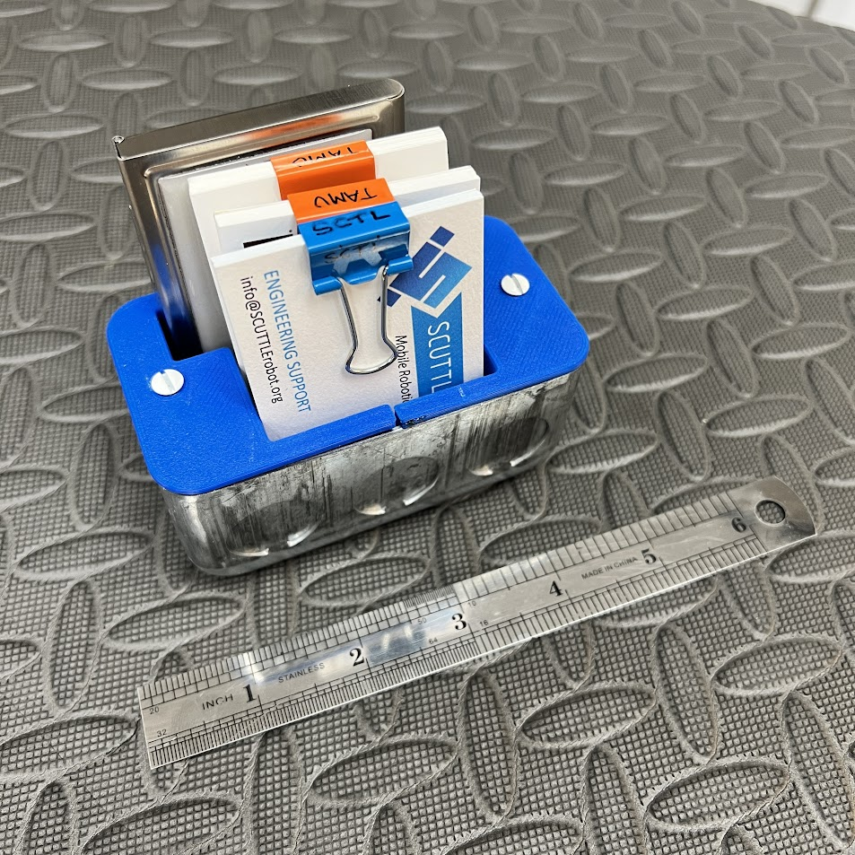

# Looking for inspiration or practical examples of how to use OpenBox? Start here!

This gallery showcases a variety of examples, including designs and configurations, to help you get started. Some examples are fully documented, while others provide a visual overview for quick reference. The gallery is regularly updated as new items are created and shared.

### Steps to Get Started:

1.	**Browse for Ideas**: Explore the gallery to find designs or workflows that match your needs.
2.	**Dive Deeper**: For detailed instructions or configurations, check the linked documentation and other sections.
3.	**Ask Questions**: If you see something in the gallery that isn’t fully documented yet, feel free to reach out:
- Leave a comment on (GrabCAD)[https://grabcad.com/library?page=1&time=all_time&sort=recent&query=openbox]
- Ask in (David’s Discord community)(https://discord.com/channels/1309520786364567594/1314395386408079410).
- Post an issue in the GitHub repository.

## Organizers
Designs for holding your toos & equipment & securing them where needed.

Overview of some tool holders made with HandyBox, for custom fitment of various round shank sizes.

Use the box with a magnet (designed for unistrut assemblies) for storing within reach.

The spacing in back of the box aligns with ordinary 1x1 inch pegboard

Or, fasten the box to a composite pegboard with the compatible screws, and still reach the fastener when the openbox is loaded.

Make a business card holder - this one has a wide section for related cards that don't fit regular business card width.

## AC Electrical
For 120v or 240v appliances with custom wires or switches

Design your own electronics box, as usual with 3d printing but use standard parts!

Switches with 22mm circle snap right into place.

## Embedded Electronics
We will feature arduino & other MCU based projects but here's the start, with a project for car adapter & embedded power control found in a PD adapter.

## DC Power

The Car Adapter converts a power tool battery to a cigarette lighter socket.  It includes a simple cover (panel) and the handy bushing (3D Printed)

_front side_

_back side with ligher socket_

_full assembly with Ridgid tool battery, 18v, and adapter setup_

## Cable Routing

The handy bushing design holds a wire or a plug in place, such as Anderson Powerwerx connectors.   It was designed by benchmarking the similar off-the-shelf designs.  The OTS bushings work great but we gain custom features by making our own.

_handy bushing next to OTS part with similar function_

_handy bushing shown placed into the box, 1/2in trade size hole around 22mm_

