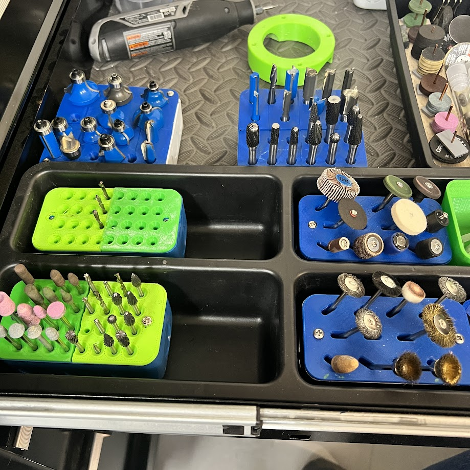
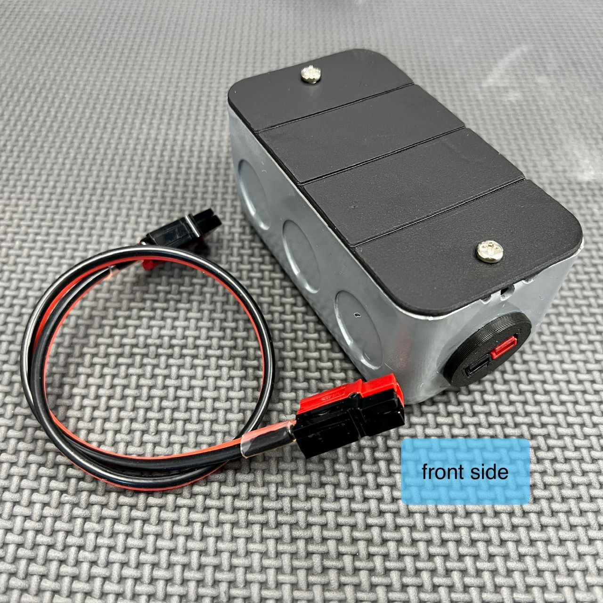
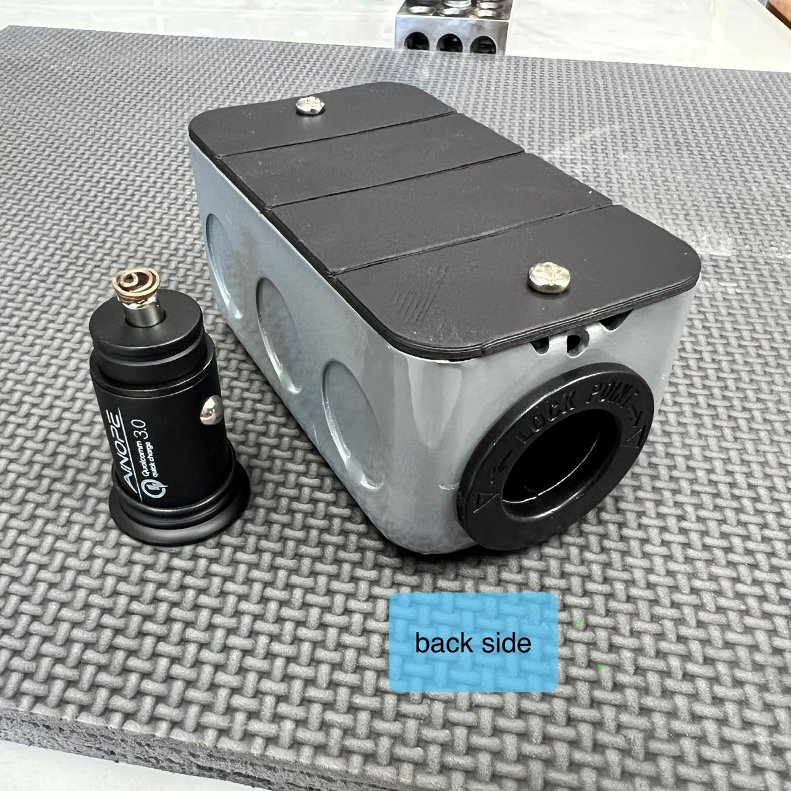
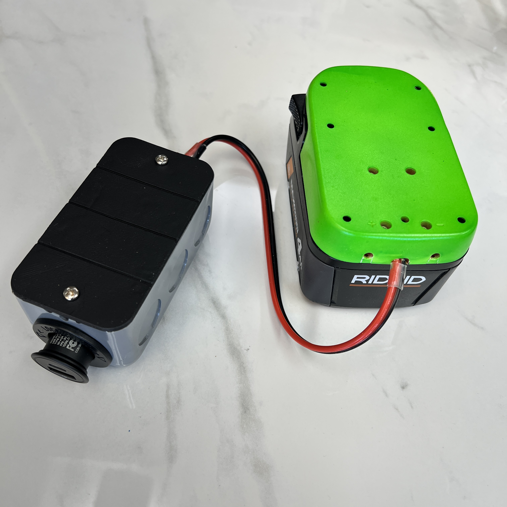
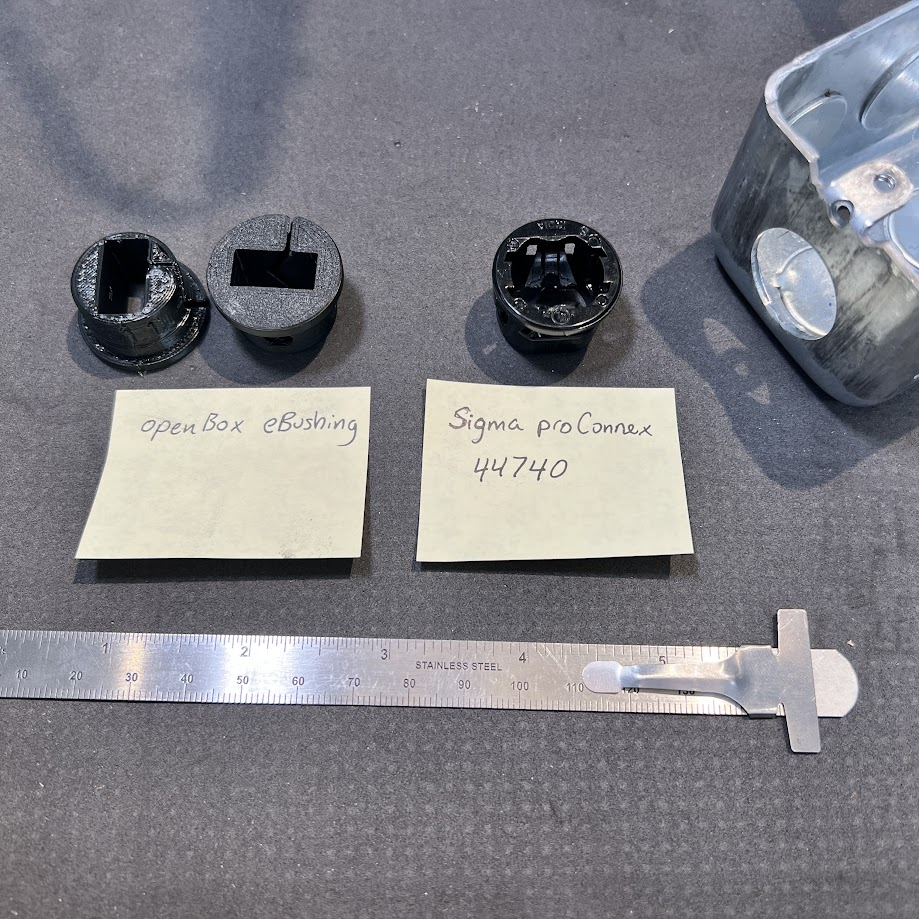
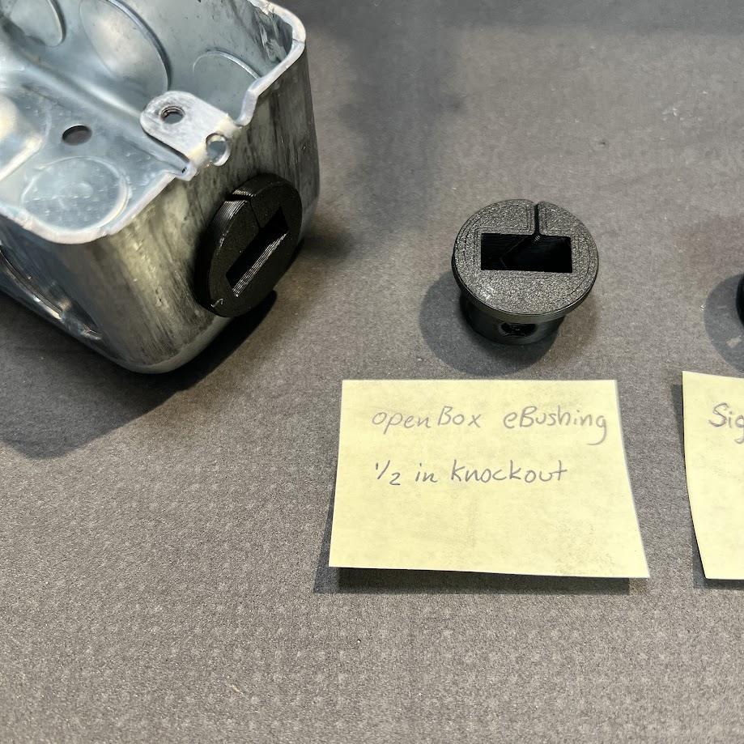

## Purpose
How to use this gallery?  
1) If you want to make a print or a design, start here and just make a quick review of some designs.  There are many designs, some are deeply documented, and many are photographed.  So, the gallery is easiest to update when we produce new items.  
2) Find your idea here and then check for more documentation & designs in the other sections.
3) If you see an item in the gallery but not documented, just send a question.  Use a comment on grabCAD, ask in David's discord, or post an issue here in the Github repository.  Then, the designers can find you and reply.

Enjoy!

## Organizers
Designs for holding your toos & equipment & securing them where needed.

Overview of some tool holders made with HandyBox, for custom fitment of various round shank sizes.

Use the box with a magnet (designed for unistrut assemblies) for storing within reach.

The spacing in back of the box aligns with ordinary 1x1 inch pegboard

Or, fasten the box to a composite pegboard with the compatible screws, and still reach the fastener when the openbox is loaded.

## AC Electrical
For 120v or 240v appliances with custom wires or switches

Design your own electronics box, as usual with 3d printing but use standard parts!

Switches with 22mm circle snap right into place.

## Embedded Electronics
We will feature arduino & other MCU based projects but here's the start, with a project for car adapter & embedded power control found in a PD adapter.

**Pictures coming soon!**

## DC Power

The Car Adapter converts a power tool battery to a cigarette lighter socket.  It includes a simple cover (panel) and the handy bushing (3D Printed)

_front side_

_back side with ligher socket_

_full assembly with Ridgid tool battery, 18v, and adapter setup_

## Cable Routing

The handy bushing design holds a wire or a plug in place, such as Anderson Powerwerx connectors.   It was designed by benchmarking the similar off-the-shelf designs.  The OTS bushings work great but we gain custom features by making our own.

_handy bushing next to OTS part with similar function_

_handy bushing shown placed into the box, 1/2in trade size hole around 22mm_

