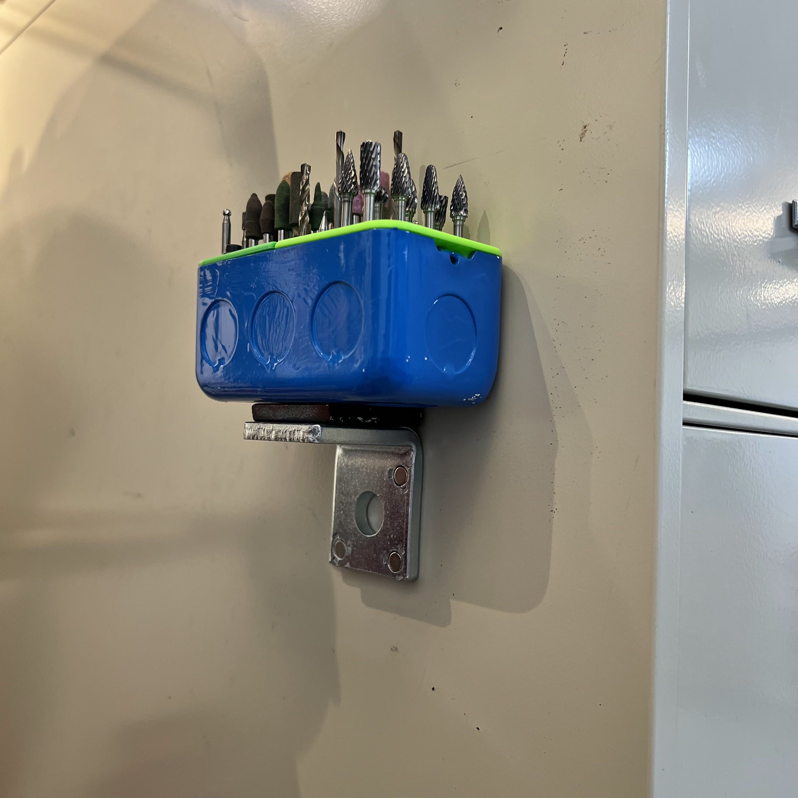
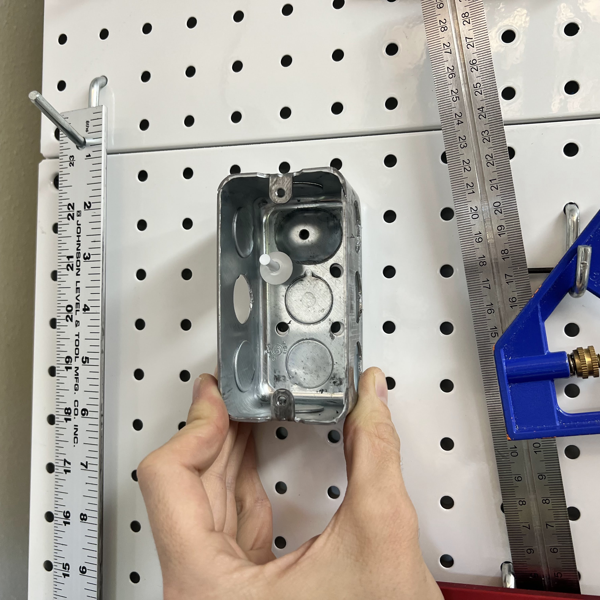
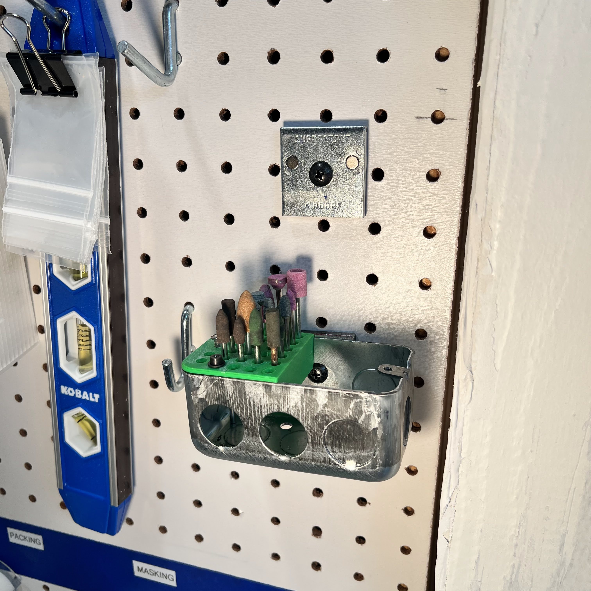
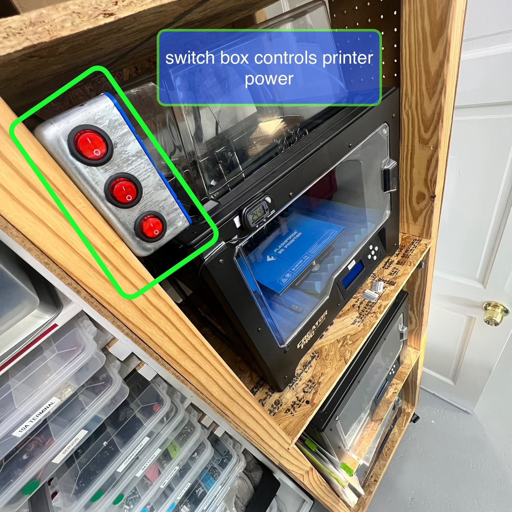
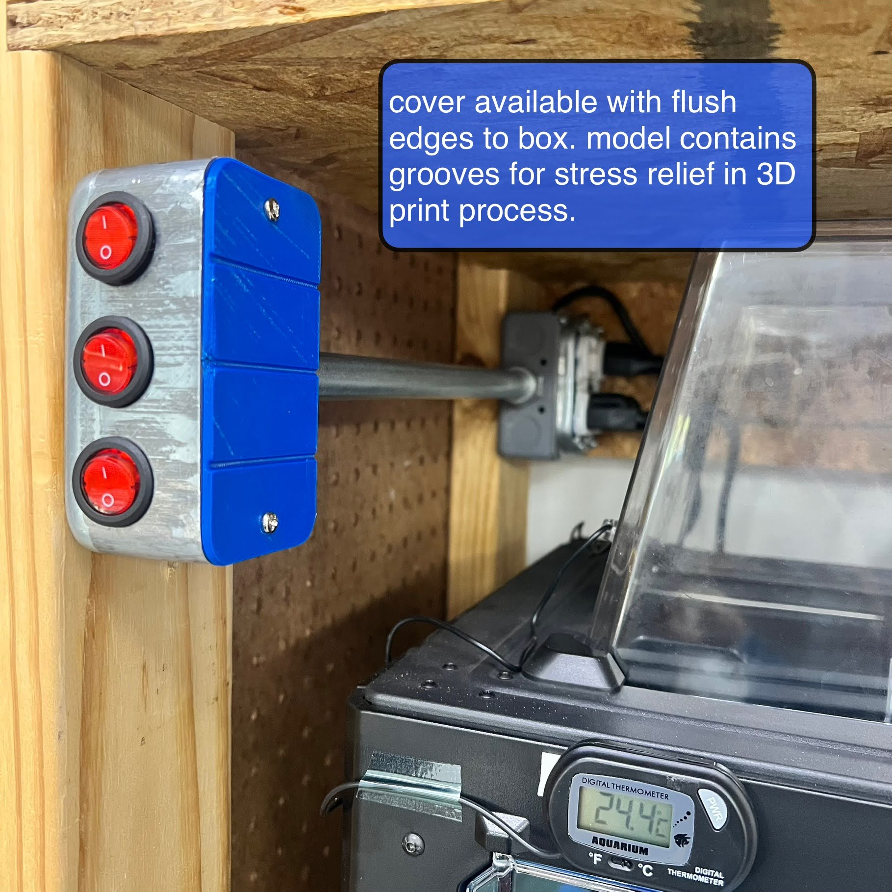

## Organizers & Tools

Use the box with a magnet (designed for unistrut assemblies) for storing within reach.

The spacing in back of the box aligns with ordinary 1x1 inch pegboard

Or, fasten the box to a composite pegboard with the compatible screws, and still reach the fastener when the openbox is loaded.

## Electronics

Design your own electronics box, as usual with 3d printing but use standard parts!

Switches with 22mm circle snap right into place.

## Embedded Electronics
coming soon
