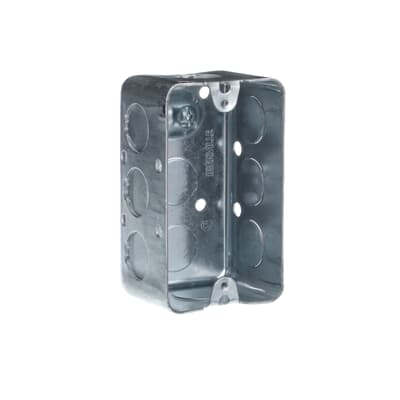
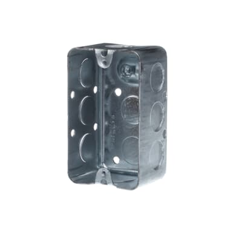
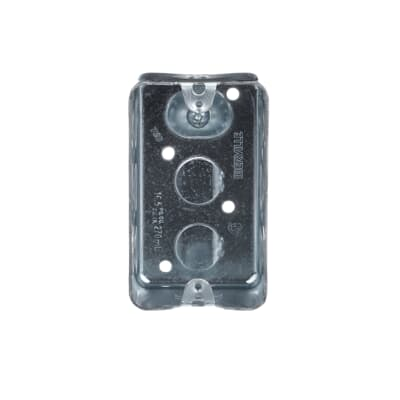

## OpenBox Project
Openbox is a collection of inventions based on a "handy box," a cheap standard part found in American hardware stores.  At about $1.80 each, this box can outperform many alternatives for it's thermal properties, rigidity, dead weight, and availability of attachments that don't require any effort at all.  This collection is intended to crack open your imagination, especially for 3D printer enthusiasts who want to create projects that demand stronger components than plain plastic.

Everyone is invited to use these designs or contribute to this design on GitHub.  Design data will be posted on grabCAD.com starting with [handybox](https://grabcad.com/library/handybox-1) and ongoing continually.

_Latest short link ► https://bit.ly/openboxproject_

## More Projects
More Open Source designs initiated by DM & SCUTTLE team:
* [SCUTTLE Nigeria](https://bit.ly/scuttleNigeria1)
* [Mechatronics Resources](https://bit.ly/openmechatronics)
* [OpenArm](https://bit.ly/openarm)
* [OpenJar](https://bit.ly/openjarproject_v1)
* [OpenBox](https://bit.ly/openboxproject)
* [OpenSpin](https:/bit.ly/openspinproject)
* [OpenAir](https://bit.ly/openairproject)

### Explore
Don't like reading? just hop onto grabCAD and jump into the designs!  Also see the [image gallery](gallery.md) but be aware it may contain only a portion of the designs.

**Example Usage***
How do you work with OpenBox? Here's one video lesson, of many to come:
<iframe width="703" src="https://www.youtube.com/embed/VLrEtrU10ow" title="Build a DIY power supply for powering electronics - using openBox" frameborder="0" allow="accelerometer; autoplay; clipboard-write; encrypted-media; gyroscope; picture-in-picture; web-share" referrerpolicy="strict-origin-when-cross-origin" allowfullscreen></iframe>

### Contribute
There are no rules!  But here's an invitation to help in the best ways: As with all of my open projects my aim is to initiate but not to create all outcomes.  As I build modules that support my electronics teaching, robotics, and so on I invite others to create items from their imagination & share them as well.  Every author can decide their own path.  I prefer to share on GrabCAD but Printables and other sites are great too.  Github is not highly popular among mechanical designers but it's great for documentation so I invite you to comment as a github user, join the project as a collaborator, or post an issue as a user that can centralize the needs for ongoing development!  

I also will continue posting related items on my youtube (david malawey) so users can see the possibilities.

 

### Limitations
There are no limits.  The example below is a countertop shaver rack, just to show a use case.  The "handybox" brings value to other designs such as:
* desirable mass, eliminates tipping
* handhed size accomodates common needs
* steel, offers high strength & magnetic function

## Electrical
Suitable 3D printed designs for openBox can enable your electronics projects & build robustness. New modules will be continually released such as button mounts, DIN brackets, and other electrical integrations.

## Mechanical
_mechanical features & designs_
The heavy steel stamping is a perfect starting point for many mechanical designs.  Over time, we will feature static figures such as customizable camera mounts, pivoting structures, attachments for parts storage, and dynamic assemblies (you could even call them robots).

### Interfacing

## Data

The OpenBox project was originally created using specifications based on the handy box commonly found in the United States. To open this project to a broader audience, we are expanding its scope and documenting handy box specifications from different countries. Below, you’ll find detailed information for each country to ensure compatibility and usability.

If you’d like to contribute to this effort, don’t hesitate to join us! Your input can help make the OpenBox project more versatile and accessible for everyone.

### USA Handy Box Specifications

- Dimensions: 4” x 2” x 1-7/8” (16.5 cubic inches)
-	Designed for standard NEC (National Electrical Code) compliance.

_technical sheets published by manufacturers_

_dimensional drawings by manufacturers (Raco & more)_

We don't have a specific structure for posting data but as I accumulate useful drawings and reliable documentation behind the branded boxes (such as Raco by Hubbel) I will upload the content for others to download.  At times, I markup a PDF with mechanical drawings to point out the key items instead of starting a document from scratch.

### Canadian Handy Box Specifications

The main manufacturer of handy boxes commonly found in Canadian hardware stores is ABB, under their Iberville brand: https://new.abb.com/products/7TBA126550R0000/1110-crt While these boxes are widely used and recognized, ABB has not yet provided a detailed data sheet for the Iberville handy box. This lack of official specifications presents a challenge for precise design adaptations, but we are working to gather the necessary details through direct measurements and other resources.

-  4” x 2-3/8” x 1-7/8” (16.5 cubic inches)
- Designed for the Canadian Electrical Code (CEC) standards.
- The key difference in the brackets is that the USA version uses straight mounting brackets, while the Canadian version features angled brackets, requiring design adjustments for compatibility.

### Get Involved

We’re working to expand the OpenBox project to include specifications from more regions and make it useful for everyone. If you have knowledge, resources, or ideas to contribute, we’d love to collaborate! Let’s work together to grow this project and support makers around the world.
